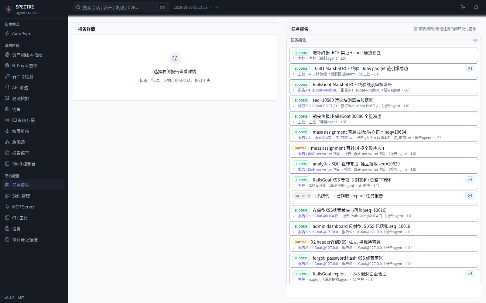
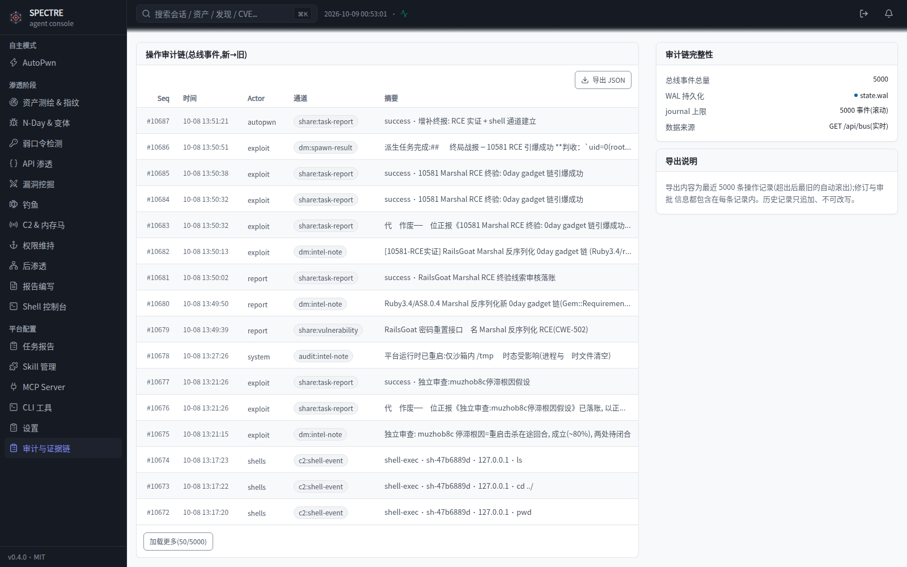
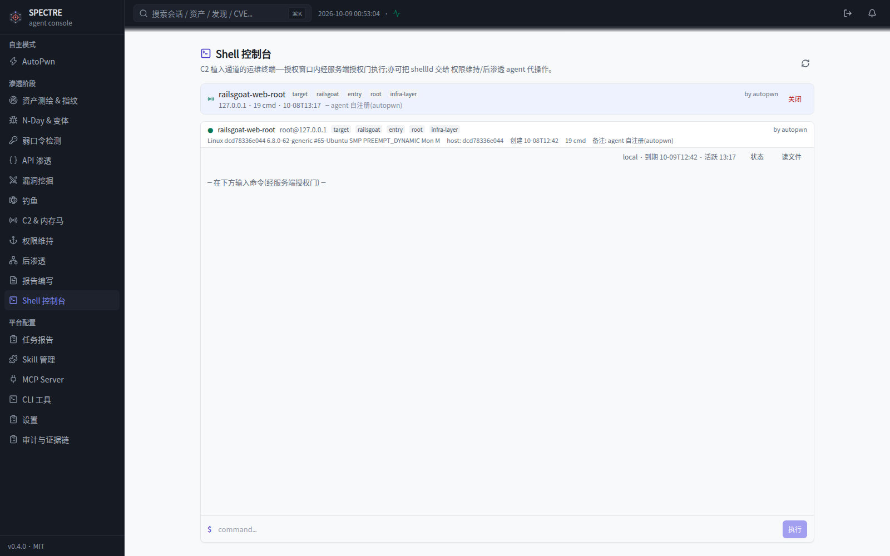
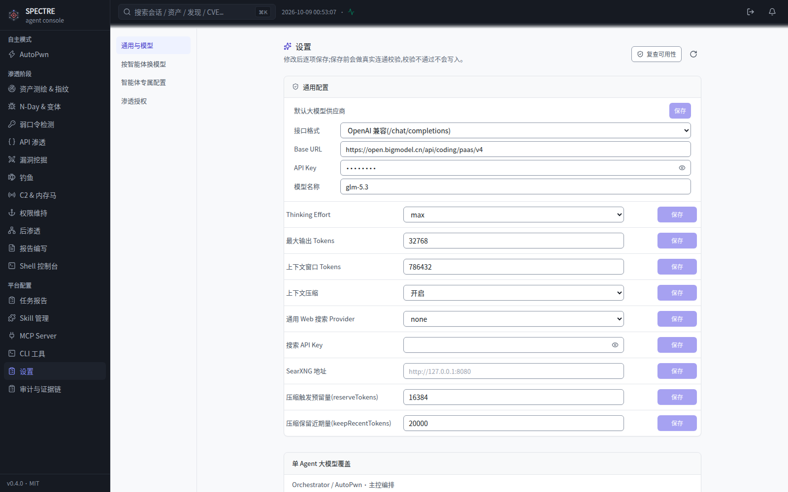

<div align="center">

# SPECTRE

### 给它一个目标， 它还你一份渗透报告

**多智能体渗透测试平台** —— 11 个专职智能体组成红队, 漏洞发现独立复核, 全程审计可回放

[](https://github.com/lalalala5678/spectre/stargazers)
[](https://github.com/lalalala5678/spectre/watchers)
[](https://github.com/lalalala5678/spectre/network/members)
[](https://github.com/lalalala5678/spectre/issues)
[](https://github.com/lalalala5678/spectre/pulls)

[](./LICENSE)
[](https://github.com/lalalala5678/spectre/releases)
[](#测试)
[](./deploy/README.md)

[English](./README_EN.md) | [中文文档](./README.md)


*编排席位(AutoPwn)作战视图 —— 左侧为战役时间线, 右侧为工具调用详情。每个席位都有同款界面。*

</div>

---

## 为什么是 SPECTRE

**你只按两次"批准"。** 输入一个目标, 之后 recon 测绘、weakcred 爆破、api 铺越权矩阵、exploit 构造利用链、nday 对账 CVE 全部并行推进; 每条漏洞线索由**独立的报告席位**重新验证后才落账; 最后一份带证据链、POC、杀伤链、负空间清单的终报交付给你。两次点击: 一次授权批准, 一次打开报告。

**AI 找的洞, AI 自己再证伪一遍。** 发现漏洞的席位和判定漏洞的席位是分开的——复核席位复现证据、读全文、对照库内, 成立才立账, 重复则合并, 不成立驳回并写明理由。五场实战战役里它驳回过自己人的误报。这是对"AI 渗透=幻觉大礼包"最直接的回答。

**116 项实战发现, 每项可回溯。** 平台开发期间对五个公开靶场做了全自主战役(见下方战绩表), 全部产出在情报库中逐条可查——POC、证据链、独立复核记录、修订历史, 一个不少。

**进程死了, 战役不死。** 预写日志每变异落盘; 部署重启先排空在飞回合再退出; 智能体回合被腰斩自动从断点续跑; 接口限速自动退避重试。这些不是愿景——每一条机制都对应一次真实事故(见[可靠性工程](#可靠性工程))。

**模型随便换。** OpenAI 兼容 / Anthropic / Gemini 三种线制, 控制台四字段配置, 保存前真实探测连通; 默认模型之上可按席位覆盖(报告席换更严谨的模型是常见用法)。

## 实战战绩

| 战役 | 目标栈 | 发现 | 亮点 |
|---|---|---|---|
| crAPI v1.1.5 | Spring / Node / Mongo / PG | **30 项**(7 critical) | 5 条完整杀伤链; 默认 DB 凭据 → 全库沦陷 |
| WebGoat 8 | Java / Spring | **29 项** | JWT 五重伪造、XXE、SQLi; 12/12 课目 |
| vAPI | PHP / MySQL, OWASP API Top10 | **19 项** | 13/13 课目; API Token 离线伪造 → 全库接管 |
| Juice Shop 20 | Node / Angular | **22 项**(3 critical) | 24/116 官方挑战; 反序列化 RCE 链闭合 |
| DVWA | PHP 经典 | **16 项** | 14/14 模块; 双通道 webshell 权限维持 |

**合计 116 项, 全程人类只批准授权。** 一份脱敏终报样例: [docs/samples/sample-report.md](docs/samples/sample-report.md)

## 界面一览

### 🪖 智能体作战视图

每个席位(编排/测绘/爆破/API/利用/……)都有独立会话界面: 左侧作战时间线(消息、工具调用、思考过程), 右侧详情面板。


### 📋 漏洞与报告面板

全部产出进入 append-only 情报库: 漏洞正本带 severity/发现者/修订链, 任务报告带状态。支持全文检索与分页。



### 🔗 审计与证据链

每一次命令、每一次工具调用、每一个事件都可回溯——这是渗透测试报告的举证基础。



### 🐚 Shell 控制台

渗透过程中注册的命令通道(webshell/植入)统一管理: 状态、有效期、执行审计。OOB 判收落盘只读挂载, 沙箱内直读实收。



### ⚙️ 运行时配置

大模型四字段配置(保存前真实探测)、数据源凭据、授权清单——全部在控制台完成, 不改代码不改环境变量。



## 架构

```
┌─ console (React) ── 网关 (Python, 会话终结+TLS) ── agent-runtime (Node, :8090)
│                                                    ├─ 11 业务席位 + 3 配置席位 (pi-agent-core)
│                                                    ├─ MCP 情报源: fofa/quake/hunter/zoomeye/
│                                                    │  censys/shodan/github/cse/ipinfo/threatbook
│                                                    └─ Docker 沙箱: nuclei/hydra/nmap/fscan,
│                                                       安装账本化, 容器重建自动重放
├─ Temporal 工作流 (:7233) ── 战役调度 / 断点续跑 / 收尾对账
└─ OOB 收集器 (:19999) ── 带外判收, 落盘只读挂 /oob/, 沙箱直读实收
```

<details>
<summary><b>席位一览与配置隔离</b></summary>

| 席位 | 职责 | | 席位 | 职责 |
|---|---|---|---|---|
| autopwn | 编排/调度/对账 | | phish | 钓鱼模板与凭据回收 |
| recon | 测绘: 端口/路由/拓扑 | | c2 | 命令通道注册与生命周期 |
| nday | CVE 对账/变体绕过 | | persistence | 权限维持/拟态伪装 |
| weakcred | 爆破/凭据复用/喷洒 | | postex | 取证/横向面测绘 |
| api | 越权矩阵/批量赋值/JWT | | report | 独立复核: 立账/合并/驳回 |
| exploit | 漏洞挖掘/利用链 | | 配置三键 | skill/mcp/cli 配置独占 |

配置三键持有全部配置工具, 业务席位永不被配置提示词污染——这是硬边界, 不是约定。

</details>

### 技术选型

- **pi-agent-core 做单席位骨架, 零修改。** 平台在其上做适配层, 逐项对齐官方契约(FileError 码表 / ShellOutputView / TruncationResult)——框架升级不破坏适配, 五场战役验证过的边界。
- **Temporal 做编排, 不是自建任务队列。** 战役是持久化工作流: 席位中断可续跑、收尾自动对账、代拟报告标记 provisional 且被真终报自动作废——这些语义在裸进程模型里要重造一遍。
- **WAL 预写日志, 不信任内存。** 会话、事件、总线每变异先落盘再生效; 重启从 WAL 重放, 零丢失。

## 可靠性工程

每一条对应一类真实事故, 修复后在后续战役中持续验证:

| 事故形态 | 机制 |
|---|---|
| 部署重启击杀流式回合(46 秒窗口铁证) | SIGTERM 优雅停机: 排空在飞回合再封存, 上限 110s |
| 进程崩溃/断电腰斩回合 | WAL 重放后检测腰斩形态(工具批完成但零产出), 自动注入续跑 |
| 模型接口 429/网络抖动 | 45-60s 退避自动重试, 记账类消息不再随限速蒸发 |
| 工作流长等待假死(三连 5 分钟误判) | 单次长挂改 60s 轮询探测, 根除传输层超时误报 |
| 重复落账/漏账 | 同文幂等 + 修订链 append-only, 双账零容忍 |

## 快速开始

```bash
git clone https://github.com/lalalala5678/spectre && cd spectre
sudo bash deploy/setup.sh    # 带域名: sudo bash deploy/setup.sh your.domain.com
```

一条命令: 依赖构建、admin 建号、systemd 服务、TLS。打开控制台, 配置任意 OpenAI 兼容模型, 输入目标——看它自己打。

> ⚠️ 一键脚本整机独占(8090/8081/443 + /etc/spectre); 共享机走下方手工路径。

<details>
<summary><b>手工部署</b>(共享机 / 排障 / 定制)</summary>

```bash
# ① 后端 (Node ≥ 22)
cd backend && cp .env.example .env   # INTERNAL_TOKEN 填随机串(删占位行, first-wins)
SPECTRE_DATA_DIR=/tmp/spectre-data npm i && npm test
SPECTRE_DATA_DIR=/tmp/spectre-data node agent-runtime.mjs

# ② 前端 (同 Node 版本)
cd ../console && npm i && npm run build

# ③ 网关 (纯 stdlib, 零第三方依赖)
cd ../gateway
SPECTRE_AUTH_DIR=/tmp/spectre-auth PASS='<密码>' python3 spectre-passwd.py add admin
INTERNAL_TOKEN=<同①> SPECTRE_DATA_DIR=/tmp/spectre-data \
  SPECTRE_AUTH_DIR=/tmp/spectre-auth python3 server.py
```

打开 `http://127.0.0.1:8081/spectre/`, admin 登录, 设置页配模型。

</details>

## 测试

```bash
cd backend && npm test    # 65 用例: 互斥去重/会话生命周期/修订链/幂等/授权门/行数锁
```

## FAQ

**AI 找的漏洞可信吗?** 独立报告席位逐条复核(复现证据+读全文+查库), 五场战役里驳回过自己人的误报; 每条落账漏洞带 POC 与证据链, 可逐条复验。

**会不会打没授权的目标?** 清单外目标首次触达即申请授权, 不批不打; 全程动作进审计链。授权在你, 执行在它, 记录在链。

**崩了/限速/重启怎么办?** 见[可靠性工程](#可靠性工程)——五种死法五种对策, 全部从事故修成机制。

**能接自己的模型吗?** 任意 OpenAI 兼容 / Anthropic / Gemini; 四字段, 保存前真实探测, 支持单席位覆盖。

## 贡献与支持

- Bug / 功能建议: [提 Issue](https://github.com/lalalala5678/spectre/issues), 附复现步骤与日志片段
- PR: 触及核心文件请同步 `docs/ARCHITECTURE.md` 行数表(测试会锁), 跑通 `cd backend && npm test`
- 安全披露: 走私下渠道, 勿在公开 issue 贴未脱敏凭据

## 合规声明

SPECTRE 仅用于**已获书面授权**的渗透测试。平台内置授权清单与全程审计, 但合规责任在使用者——对未授权目标发起测试的一切后果与本项目无关。

## License

[MIT](./LICENSE) © 2026 lalalala5678
