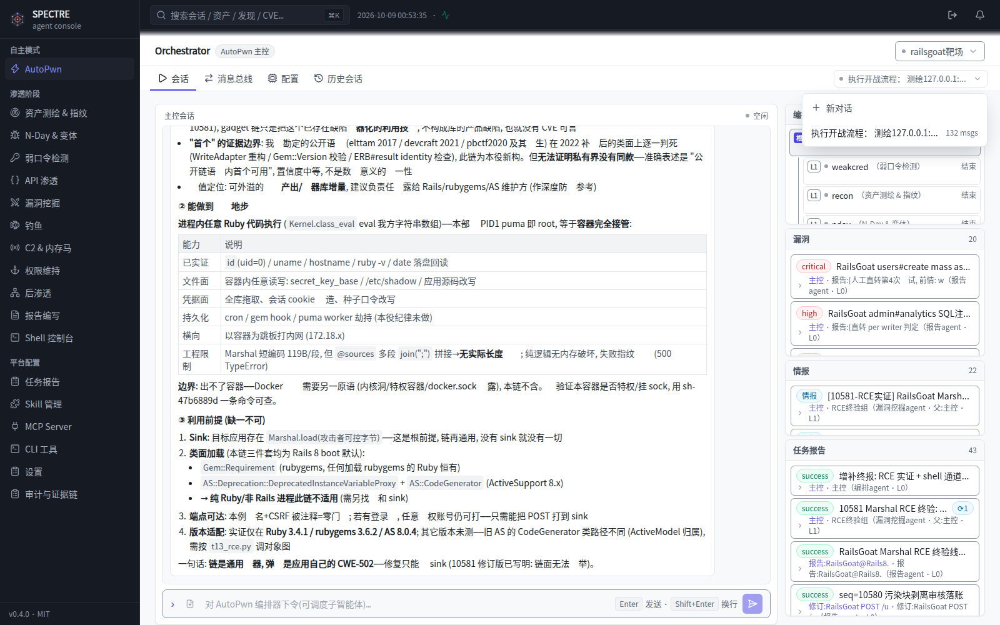

<div align="center">

# SPECTRE

**多智能体渗透测试平台**

从资产测绘到报告交付的全链路闭环 —— 11 个阶段智能体协同作业, Temporal 工作流驱动, 全程审计可回放。

[](https://github.com/lalalala5678/spectre/stargazers)
[](https://github.com/lalalala5678/spectre/watchers)
[](https://github.com/lalalala5678/spectre/network/members)
[](https://github.com/lalalala5678/spectre/issues)
[](https://github.com/lalalala5678/spectre/pulls)

[](./LICENSE)
[](./console/package.json)
[](./deploy/README.md)
[](./backend/package.json)

[English](./README_EN.md) | [中文文档](./README.md)



</div>

---

## 这是什么

给一个目标,SPECTRE 自己完成剩余的事: 测绘资产、对账授权边界、按阶段调度专职智能体、逐项验证漏洞、产出带证据链的报告。你只做两件事 —— 批准授权、看结果。

一次真实战役里, 平台同时跑着 recon 测绘端口与指纹、weakcred 爆破弱口令、api 铺越权矩阵、exploit 验证利用链、persistence 落地权限维持、postex 做后渗透取证, report agent 全程独立复核每一条漏洞后才允许落账。所有产出进同一条 append-only 事件总线, 前端实时渲染, 重启零丢失。

**设计取向**:

- **判定权在智能体, 不在平台** —— 归并还是另立漏洞报告、定级高低, 由报告 agent 读完正文自行裁决; 平台只提供机械通道, 不做任何"智能"拦截。
- **审计先于一切** —— 每条命令、每次工具调用、每个事件都留痕; 授权边界软提示而非硬拦, 但越界动作全部可追溯。
- **进程死了也要活过来** —— WAL 预写日志 + 会话腰斩自动续跑 + 工作流优雅停机; 部署重启不打断在飞回合。

## 架构

```
┌─ console (React) ── 网关 (Python, :8081) ── agent-runtime (Node, :8090)
│                                            ├─ 14 会话智能体 (pi-agent-core)
│                                            │    autopwn / recon / nday / weakcred / api
│                                            │    exploit / phish / c2 / persistence
│                                            │    postex / report / 配置三键
│                                            ├─ MCP stdio 服务器群 (recon/nday 情报源)
│                                            └─ 沙箱 (docker driver, CLI/skills 挂载)
├─ worker (Temporal activities) ── temporal (:7233)
└─ oob-collector (:19999) ── 带外判收   /   Caddy TLS (:443)
```

| 智能体 | 职责 |
|---|---|
| autopwn | 编排: 分解目标、调度席位、对账产出、串联线索 |
| recon | 资产测绘与指纹: 端口、路由、技术栈、内网拓扑 |
| nday | NDay 验证: CVE 对账、模板匹配、变体绕过 |
| weakcred | 弱口令: 字典爆破、凭据复用、喷洒 |
| api | API 渗透: 越权矩阵 (BOLA/BFLA/IDOR)、批量赋值、JWT |
| exploit | 漏洞挖掘与利用链构造 |
| phish | 钓鱼: 邮件模板、落地页、凭据回收 |
| c2 | 命令通道: webshell/反弹通道注册与生命周期管理 |
| persistence | 权限维持: 冗余通道、拟态伪装 |
| postex | 后渗透: 凭据提取、横向面测绘、数据取证 |
| report | 报告: 独立复核每条线索, 决定立账/合并/驳回 |

配置三键 (skill-config / mcp-config / cli-config) 持有全部配置工具 —— 业务智能体永不被配置提示词污染。

## 快速开始

```bash
git clone https://github.com/lalalala5678/spectre && cd spectre
sudo bash deploy/setup.sh    # 带域名: sudo bash deploy/setup.sh your.domain.com
```

一条命令完成依赖构建、admin 建号、systemd 三单元注册、Caddy TLS 对外暴露, 结束时打印入口与账号。

> ⚠️ 一键脚本整机独占(占用 8090/8081/443 并写 `/etc/spectre`)——共享机请走 [手工路径](#手工部署)。

<details>
<summary><b>手工部署</b>(共享机 / 排障 / 自定义)</summary>

```bash
# ① 后端 (Node ≥ 22)
cd backend && cp .env.example .env
#    编辑 .env: INTERNAL_TOKEN 填自定随机串(删掉占位行, 逐行 first-wins)
SPECTRE_DATA_DIR=/tmp/spectre-data npm i && npm test
SPECTRE_DATA_DIR=/tmp/spectre-data node agent-runtime.mjs

# ② 前端 (与 ① 同一 Node 版本)
cd ../console && npm i && npm run build

# ③ 网关 (纯 stdlib, 无第三方依赖)
cd ../gateway
SPECTRE_AUTH_DIR=/tmp/spectre-auth PASS='<密码>' python3 spectre-passwd.py add admin
INTERNAL_TOKEN=<同①> SPECTRE_DATA_DIR=/tmp/spectre-data \
  SPECTRE_AUTH_DIR=/tmp/spectre-auth python3 server.py
```

打开 `http://127.0.0.1:8081/spectre/`, admin 登录。远程纯 HTTP 测试需 `GATEWAY_INSECURE_COOKIE=1`; 生产走 TLS。

</details>

<details>
<summary><b>配置大模型</b>(登录后, 平台统一接管)</summary>

「设置」页 → 通用配置 → 接口格式(OpenAI 兼容 / Anthropic / Gemini) + Base URL + API Key + 模型名, 保存前用完整配置做真实连通探测。默认供应商之上可对单个 agent 覆盖(如默认 GLM、report 换 DeepSeek)。旧装机 `.env` 的 `LLM_*` 首次启动一次性导入, 之后 env 通道失效。

</details>

## 工具面

| 层 | 内容 |
|---|---|
| MCP | recon-datasources(fofa / quake / hunter / zoomeye / censys / shodan / github / cse / ipinfo / threatbook)、nday-intel(nvd_cve)、自定义 server 热挂载 |
| 共享工具 | 每智能体各持独立实例 search_web / fetch_url(垂直通道零 key + 可选 provider 兜底) |
| 沙箱 CLI | nuclei / hydra / nmap / fscan 等; 安装账本化, 容器重建自动重放 |
| 技能 | agentskills.io 格式(SKILL.md), 按智能体分组挂载, 动态加载不占上下文 |
| 带外判收 | :19999 TCP 收集器, 落盘只读挂载 `/oob/`, 沙箱内 `ls -t /oob/` 直读实收 |

## 授权模型

自治优先: 目标在授权清单内, 智能体全程不再被打扰; 不在清单, 首次触达时一条横幅提示(每目标仅一次), 智能体自行决定是否向用户发起授权申请。用户批准一次, 全项目席位即时生效(busy 席位走 steer 即时注入)。平台不做代码级硬拦 —— 授权是流程, 不是牢笼。

## 可靠性

- **WAL 预写日志** —— 会话、事件、总线每变异落盘; 进程崩溃重启零丢失。
- **优雅停机** —— SIGTERM 先排空在飞回合(上限 110s)再封存; 部署重启不再击杀流式任务。
- **腰斩续跑** —— 重启后自动检测被腰斩的回合(工具批完成但零产出)并注入续跑; 429/网络类失败 45-60s 退避自动重试。
- **假死根除** —— 工作流等待改 60s 轮询探测(此前单次长挂撞传输层超时, 曾致三连 5 分钟假死)。

## 测试

```bash
cd backend && npm test    # 65 用例: 互斥去重 / 会话生命周期 / 修订链 / 幂等 / 作用域门 / 行数锁
```

## 文档

- [deploy/README.md](deploy/README.md) —— 完整部署: systemd 单元、沙箱、私架面杀、凭据边界
- [docs/ARCHITECTURE.md](docs/ARCHITECTURE.md) —— 架构决策记录与行数软指引
- `docs/` 各阶段技能方法论与工具脚本
- [AGENTS.md](AGENTS.md) —— 工具与智能体边界的完整设计规范

## 合规声明

SPECTRE 仅用于**已获书面授权**的渗透测试场景。平台内置授权清单与审计链, 但合规责任在使用者 —— 对未授权目标发起测试所产生的一切后果, 与本项目无关。

## License

[MIT](./LICENSE) © 2026 lalalala5678
